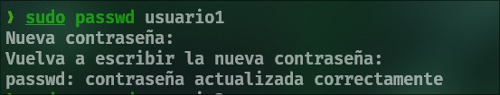
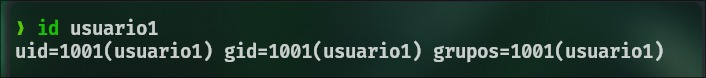
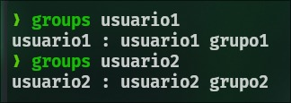
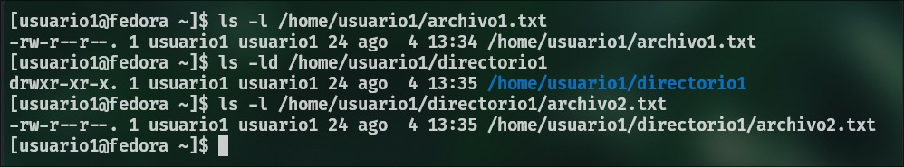
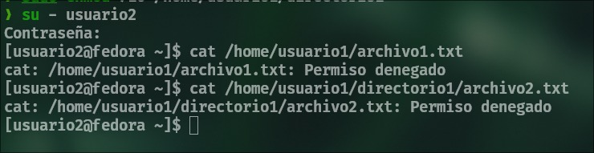
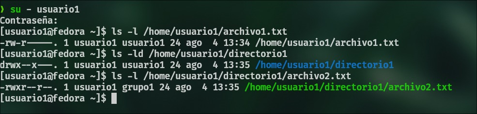

# Activiadad 3

# Parte 1: Gestión de Usuarios

## 1. Creación de Usuarios
```bash
sudo useradd usuario1
sudo useradd usuario2
sudo useradd usuario3
```

## 2. Asignación de Contraseñas
```bash
sudo passwd usuario1
sudo passwd usuario2
sudo passwd usuario3
```



## 3. Información de Usuarios
```bash
id usuario1
```



## 4. Eliminación de Usuarios
```bash
sudo userdel usuario3
```

# Parte 2: Gestión de Grupos

## 1. Creación de Grupos
```bash
sudo groupadd grupo1
sudo groupadd grupo2
```

## 2. Agregar Usuarios a Grupos
```bash
sudo usermod -aG grupo1 usuario1
sudo usermod -aG grupo2 usuario2
```

## 3. Verificar Membresía
```bash
groups usuario1
groups usuario2
```



## 4. Eliminar Grupo
```bash
sudo groupdel grupo2
```

# Parte 3: Gestión de Permisos

## 1. Creación de Archivos y Directorios
```bash
su - usuario1
echo "Contenido del archivo 1" > archivo1.txt
mkdir directorio1
echo "Contenido del archivo 2" > directorio1/archivo2.txt
```

## 2. Verificar Permisos
```bash
ls -l /home/usuario1/archivo1.txt
ls -ld /home/usuario1/directorio1
ls -l /home/usuario1/directorio1/archivo2.txt
```



## 3. Modificar Permisos usando `chmod` con Modo Numérico
```bash
sudo chmod 640 /home/usuario1/archivo1.txt
```

## 4. Modificar Permisos usando `chmod` con Modo Simbólico
```bash
sudo chmod u+x /home/usuario1/directorio1/archivo2.txt
```

## 5. Cambiar el Grupo Propietario
```bash
sudo chown :grupo1 /home/usuario1/directorio1/archivo2.txt
```

## 6. Configurar Permisos de Directorio
```bash
sudo chmod 710 /home/usuario1/directorio1
```

## 7. Comprobación de Acceso
```bash
su - usuario2
cat /home/usuario1/archivo1.txt
cat /home/usuario1/directorio1/archivo2.txt
```



## 8. Verificación Final
```bash
ls -l /home/usuario1/archivo1.txt
ls -ld /home/usuario1/directorio1
ls -l /home/usuario1/directorio1/archivo2.txt
```



# Reflexión: (Opcional)

1. ¿Por qué es importante gestionar correctamente los usuarios y permisos en un sistema operativo?

La gestión adecuada de usuarios y permisos es fundamental por varias razones:

- Seguridad: Limita el acceso a recursos y datos sensibles, protegiendo la integridad del sistema y la privacidad de la información.
- Responsabilidad: Permite rastrear las acciones de cada usuario, facilitando la auditoría y la resolución de problemas.
- Separación de preocupaciones: Ayuda a mantener un entorno organizado donde cada usuario tiene acceso solo a lo que necesita para su trabajo.
- Prevención de errores: Evita que usuarios sin experiencia modifiquen archivos críticos del sistema accidentalmente.

2. ¿Qué otros comandos o técnicas conocen para gestionar permisos en Linux?

Además de los comandos básicos como chmod, chown, y chgrp, existen otras herramientas y técnicas:

- sudo: Para otorgar privilegios temporales a usuarios para ejecutar comandos específicos.
