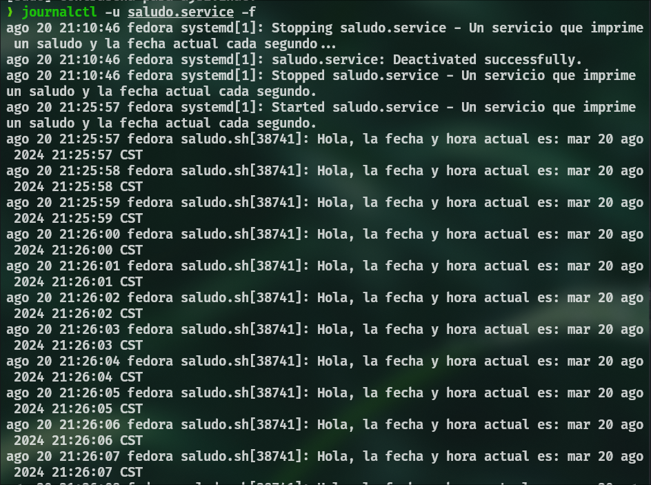

# Actividad 4

Servicio que imprime un saludo y la fecha actual cada segudno

## Script
Archivo llamado `saludo.sh` en `/usr/local/bin` con el siguiente contenido

```bash
#!/usr/bin/env bash

while true
do
    echo "Hola, la fecha y hora actual es: $(date)"
    # dormir durante 1 segundo
    sleep 1 
done
```

## Permisos
Se debe asignar permisos de ejecución al script

```bash
sudo chmdo +x /usr/local/bin/saludo.sh
```

## Servicio
Se debe crear un archivo llamado `saludo.service` en `/etc/systemd/system` con lo siguiente:


```bash
[Unit]
Description=Servicio que imprime un saludo y la fecha actual cada segundo

[Service]
ExecStart=/usr/local/bin/saludo.sh

[Install]
WantedBy=multi-user.target
```

## Comandos
| Acción                    | Comando                                                                                                                                          |
|---------------------------|--------------------------------------------------------------------------------------------------------------------------------------------------|
| **Habilitar el servicio**  | `sudo systemctl enable saludo.service`                                                                                                           |
| **Iniciar el servicio**    | `sudo systemctl start saludo.service`                                                                                                            |
| **Verificar el servicio**  | `sudo systemctl status saludo.service`                                                                                                           |
| **Detener el servicio**    | `sudo systemctl stop saludo.service`                                                                                                             |
| **Deshabilitar el servicio** | `sudo systemctl disable saludo.service`                                                                                                        |
| **Eliminar el servicio**   | `sudo systemctl stop saludo`<br>`sudo rm /etc/systemd/system/saludo.service`<br>`sudo rm /usr/local/bin/saludo.sh`<br>`sudo systemctl daemon-reload` |


## Logs
Para ver los logs del servicio:
```bash
journalctl -u saludo.service
```

Para ver los logs en tiempo real:
```
journalctl -u saludo.service -f
```

