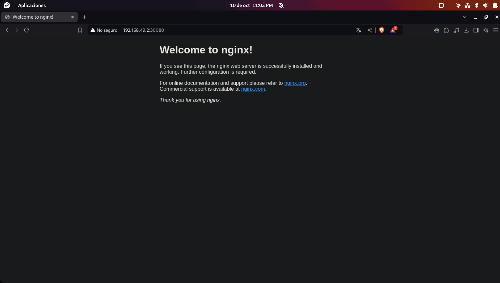

# 1. Instalación de Minikube en Fedora

## Prerrequisitos

### Verificar virtualización

Primero, debes verificar si tu CPU tiene virtualización habilitada:

```bash
egrep -c '(vmx|svm)' /proc/cpuinfo
```

Si el resultado es `1` o más, la virtualización está habilitada.

### Verificar la instalación de Docker

Asegúrate de tener Docker instalado y en ejecución:

```bash
sudo dnf install docker
sudo systemctl start docker
sudo systemctl enable docker
```

Luego, añade tu usuario al grupo de Docker para evitar usar `sudo` con cada comando de Docker:

```bash
sudo usermod -aG docker $USER
```

**Nota**: Necesitarás cerrar sesión y volver a iniciarla para que este cambio tenga efecto.

## Pasos de instalación de Minikube

1. Instala las dependencias necesarias para la virtualización:

```bash
sudo dnf install -y qemu-kvm libvirt bridge-utils
```

2. Inicia y habilita el servicio de virtualización `libvirtd`:

```bash
sudo systemctl start libvirtd
sudo systemctl enable libvirtd
```

3. Instala `kubectl` (herramienta de línea de comandos de Kubernetes):

```bash
curl -LO https://storage.googleapis.com/kubernetes-release/release/$(curl -s https://storage.googleapis.com/kubernetes-release/release/stable.txt)/bin/linux/amd64/kubectl
chmod +x kubectl
sudo mv kubectl /usr/local/bin/
```

4. Instala Minikube:

```bash
curl -Lo minikube https://storage.googleapis.com/minikube/releases/latest/minikube-linux-amd64
chmod +x minikube
sudo mv minikube /usr/local/bin/
```

5. Inicia Minikube con Docker como controlador:

```bash
minikube start --driver=docker
```

## Verificación de la instalación

Para comprobar que Minikube y Kubernetes se han instalado correctamente, ejecuta los siguientes comandos:

```bash
minikube status
kubectl cluster-info
```

## Comandos útiles

- Detener Minikube: 
  ```bash
  minikube stop
  ```

- Eliminar el clúster: 
  ```bash
  minikube delete
  ```

- Abrir el dashboard de Kubernetes: 
  ```bash
  minikube dashboard
  ```

## Configuración adicional

Si deseas establecer Docker como el controlador predeterminado para Minikube, puedes configurar lo siguiente:

```bash
minikube config set driver docker
```

---

# 2. Desplegar Nginx en Kubernetes

### Paso 1: Aplicar la configuración de Nginx

Aplica el archivo de configuración de despliegue de Nginx:

```bash
kubectl apply -f nginx-deployment.yaml
```

### Paso 2: Exponer el servicio Nginx

Para acceder al servicio Nginx, ejecuta:

```bash
minikube service nginx-service
```

O bien, si solo deseas obtener la URL del servicio, usa:

```bash
minikube service nginx-service --url
```

### Ejemplo de salida esperada

Aparecerá una tabla similar a la siguiente, donde podrás ver la URL para acceder al servicio:

| NAMESPACE |     NAME      | TARGET PORT |            URL            |
|-----------|---------------|-------------|---------------------------|
| default   | nginx-service |          80 | http://192.168.49.2:30080  |

Al acceder a la URL, deberías ver una página de Nginx como la siguiente:



---

# 3. Funcionamiento de Kubernetes local (Minikube)

En un entorno local como Minikube, no existe la separación física entre nodos *master* y *worker*. Minikube crea un clúster de un solo nodo que ejecuta tanto los componentes del plano de control (master) como los componentes de *worker* en la misma máquina virtual o contenedor. Esto simplifica el desarrollo y pruebas locales sin perder la funcionalidad esencial de Kubernetes.

### Arquitectura visual simplificada

```
+------------------------------------------+
|                 Minikube                 |
|   +----------------------------------+   |
|   |     Control Plane Components     |   |
|   |   - API Server                   |   |
|   |   - Scheduler                    |   |
|   |   - Controller Manager           |   |
|   |   - etcd                         |   |
|   +----------------------------------+   |
|                                          |
|   +----------------------------------+   |
|   |       Worker Node Components     |   |
|   |   - kubelet                      |   |
|   |   - kube-proxy                   |   |
|   |   - Container Runtime            |   |
|   +----------------------------------+   |
+------------------------------------------+
```
